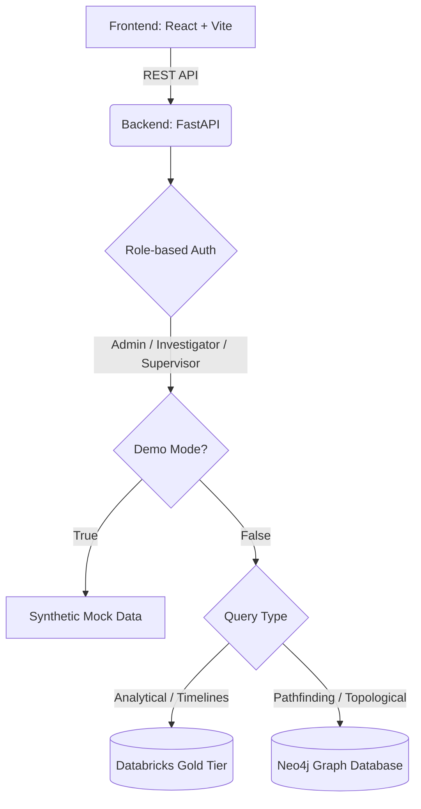

# Anveshak 🕵️‍♂️🔍

**Evidence-led Investigation Intelligence Platform**

Anveshak is a powerful, AI-assisted criminal-investigation network platform. It is designed to help investigators seamlessly explore, connect, and analyze relationships among people, communications, vehicles, locations, and financial transactions. 

> ⚠️ **Decision Support Only:** This application is a decision-support system. It is not designed to make autonomous investigative decisions. Every analytical lead is strictly marked for human verification.

---

## 🚀 Key Features
- **Interactive Graph Visualization:** Uncover hidden connections across complex topologies using React Flow.
- **Role-Based Access Control:** Tailored dashboards for Admins, Investigators, and Supervisors.
- **High-Performance Backend:** Powered by FastAPI for rapid data processing and RESTful endpoints.
- **Advanced Data Processing:** Leverages Databricks for analytical data (Gold tier) and Neo4j for graph topology (shortest-path queries).
- **Synthetic Demo Mode:** A fully-featured fallback demo mode using high-quality synthetic data for presentation and training without requiring database credentials.

---

## 🏗️ System Architecture



### Data Flow Breakdown
1. **Frontend**: Requests data from REST endpoints on the FastAPI backend.
2. **Backend**:
   - Validates user role and authentication.
   - If `is_demo_mode()` is active, serves synthetic data natively.
   - Otherwise, dispatches heavy analytical requests to **Databricks** and multi-hop graph queries to **Neo4j**.
3. **Databricks**: Acts as the single source of truth for structured intelligence (Gold tier).
4. **Neo4j**: Optimized for shortest-path routing and multi-degree connections.

---

## 💻 Tech Stack

| Domain | Technology |
|---|---|
| **Frontend** | React, TypeScript, Vite, Tailwind CSS, Framer Motion, React Flow, Recharts |
| **Backend** | FastAPI (Python), Uvicorn |
| **Databases** | Databricks (Analytical Data), Neo4j Aura (Graph Topology) |

---

## 🛠️ Local Setup Instructions

### 1. Backend Setup

First, navigate to the backend directory and set up the Python virtual environment.

```bash
cd backend
python -m venv venv

# On Windows:
venv\Scripts\activate
# On Mac/Linux:
source venv/bin/activate

pip install -r requirements.txt
```

### 2. Environment Variables

Secure your credentials by creating a `.env` file at the root of the project. A template is provided.

```bash
cp .env.example .env
```
*Note: If you do not configure Neo4j and Databricks credentials in the `.env` file, the backend will gracefully fall back into **Demo Fallback Mode**.*

### 3. Run the Backend

Launch the FastAPI server:

```bash
cd backend
uvicorn main:app --reload --port 8000
```
> The API will now be available at `http://localhost:8000`.

### 4. Frontend Setup

In a new terminal window, initialize the frontend:

```bash
cd frontend
npm install
```

### 5. Run the Frontend

Start the Vite development server:

```bash
npm run dev
```
> The application will now be available at `http://localhost:5173`.

---

## 🔐 Demo Accounts

The application ships with a robust local demo login system. Use these credentials to test the various role-based dashboards:

- **Admin:** `admin@anveshak.demo` / `Admin@123`
- **Investigator:** `investigator@anveshak.demo` / `Investigator@123`
- **Supervisor:** `supervisor@anveshak.demo` / `Supervisor@123`

---

## 📚 Documentation

Dive deeper into the system's inner workings:
- [System Architecture](docs/architecture.md)
- [Databricks & Neo4j Integration Strategy](docs/databricks-neo4j-integration.md)

---

## 🛑 Security Warning
- **Never commit** the `.env` file or hardcode credentials into the frontend code. 
- Keep authentication securely behind the FastAPI interface. 
- All sensitive datasets (e.g., `SIH datasets`) are strictly ignored via `.gitignore` to prevent data leakage.
